# CareMate ER Model

> 依據 `Database/schema.sql` 與 DAO 欄位使用整理。`FK*` 表示推論關聯，原始 SQL 未宣告 FOREIGN KEY 約束。

```mermaid
erDiagram
    MEMBER ||--o| ELDER : "member_id"
    MEMBER ||--o| CAREGIVER : "member_id"
    ELDER ||--o{ HEALTH_RECORD : "elder_id"
    ELDER ||--o{ MEDICINE_RECORD : "elder_id"
    ELDER ||--o{ MEAL_RECORD : "elder_id"
    ELDER ||--o{ MOOD_RECORD : "elder_id"
    ELDER ||--o{ CARE_TASK : "elder_id"
    ELDER ||--o{ SCHEDULE : "elder_id"
    ELDER ||--o{ CONTACT : "elder_id"
    ELDER ||--o{ NOTIFICATION : "elder_id"
    ELDER ||--o{ EMERGENCY_LOG : "elder_id"
    ELDER ||--o{ TRANSLATION_HISTORY : "elder_id"

    MEMBER {
        INT member_id "PK"
        VARCHAR(50) account ""
        VARCHAR(100) password ""
        VARCHAR(50) name ""
        VARCHAR(30) role ""
        VARCHAR(30) phone ""
        VARCHAR(100) email ""
        VARCHAR(20) status ""
        TIMESTAMP created_at ""
        TIMESTAMP updated_at ""
    }
    ELDER {
        INT elder_id "PK"
        INT member_id "FK"
        VARCHAR(50) name ""
        VARCHAR(20) gender ""
        DATE birthday ""
        TEXT note ""
        TIMESTAMP created_at ""
        TIMESTAMP updated_at ""
    }
    CAREGIVER {
        INT caregiver_id "PK"
        INT member_id "FK"
        VARCHAR(50) name ""
        VARCHAR(50) nationality ""
        VARCHAR(50) language ""
        TIMESTAMP created_at ""
        TIMESTAMP updated_at ""
    }
    HEALTH_RECORD {
        INT health_id "PK"
        INT elder_id "FK"
        VARCHAR(255) col1 ""
        VARCHAR(255) col2 ""
        VARCHAR(255) col3 ""
        VARCHAR(255) col4 ""
        TEXT note ""
        VARCHAR(30) record_time ""
        TIMESTAMP created_at ""
        TIMESTAMP updated_at ""
    }
    MEDICINE_RECORD {
        INT medicine_id "PK"
        INT elder_id "FK"
        VARCHAR(255) col1 ""
        VARCHAR(255) col2 ""
        VARCHAR(255) col3 ""
        VARCHAR(255) col4 ""
        TEXT note ""
        VARCHAR(30) record_time ""
        TIMESTAMP created_at ""
        TIMESTAMP updated_at ""
    }
    MEAL_RECORD {
        INT meal_id "PK"
        INT elder_id "FK"
        VARCHAR(255) col1 ""
        VARCHAR(255) col2 ""
        VARCHAR(255) col3 ""
        VARCHAR(255) col4 ""
        TEXT note ""
        VARCHAR(30) record_time ""
        TIMESTAMP created_at ""
        TIMESTAMP updated_at ""
    }
    MOOD_RECORD {
        INT mood_id "PK"
        INT elder_id "FK"
        VARCHAR(255) col1 ""
        VARCHAR(255) col2 ""
        VARCHAR(255) col3 ""
        VARCHAR(255) col4 ""
        TEXT note ""
        VARCHAR(30) record_time ""
        TIMESTAMP created_at ""
        TIMESTAMP updated_at ""
    }
    CARE_TASK {
        INT task_id "PK"
        INT elder_id "FK"
        VARCHAR(255) col1 ""
        VARCHAR(255) col2 ""
        VARCHAR(255) col3 ""
        VARCHAR(255) col4 ""
        TEXT note ""
        VARCHAR(30) record_time ""
        TIMESTAMP created_at ""
        TIMESTAMP updated_at ""
    }
    SCHEDULE {
        INT schedule_id "PK"
        INT elder_id "FK"
        VARCHAR(255) col1 ""
        VARCHAR(255) col2 ""
        VARCHAR(255) col3 ""
        VARCHAR(255) col4 ""
        TEXT note ""
        VARCHAR(30) record_time ""
        TIMESTAMP created_at ""
        TIMESTAMP updated_at ""
    }
    CONTACT {
        INT contact_id "PK"
        INT elder_id "FK"
        VARCHAR(255) col1 ""
        VARCHAR(255) col2 ""
        VARCHAR(255) col3 ""
        VARCHAR(255) col4 ""
        TEXT note ""
        VARCHAR(30) record_time ""
        TIMESTAMP created_at ""
        TIMESTAMP updated_at ""
    }
    NOTIFICATION {
        INT notification_id "PK"
        INT elder_id "FK"
        VARCHAR(255) col1 ""
        VARCHAR(255) col2 ""
        VARCHAR(255) col3 ""
        VARCHAR(255) col4 ""
        TEXT note ""
        VARCHAR(30) record_time ""
        TIMESTAMP created_at ""
        TIMESTAMP updated_at ""
    }
    EMERGENCY_LOG {
        INT emergency_id "PK"
        INT elder_id "FK"
        VARCHAR(255) col1 ""
        VARCHAR(255) col2 ""
        VARCHAR(255) col3 ""
        VARCHAR(255) col4 ""
        TEXT note ""
        VARCHAR(30) record_time ""
        TIMESTAMP created_at ""
        TIMESTAMP updated_at ""
    }
    TRANSLATION_HISTORY {
        INT translation_id "PK"
        INT elder_id "FK"
        VARCHAR(255) col1 ""
        VARCHAR(255) col2 ""
        VARCHAR(255) col3 ""
        VARCHAR(255) col4 ""
        TEXT note ""
        VARCHAR(30) record_time ""
        TIMESTAMP created_at ""
        TIMESTAMP updated_at ""
    }
```

## 資料表摘要
- `member`：會員帳號
- `elder`：被照顧者資料
- `caregiver`：照顧者資料
- `health_record`：血壓體溫紀錄
- `medicine_record`：用藥紀錄
- `meal_record`：飲食紀錄
- `mood_record`：情緒紀錄
- `care_task`：照顧任務
- `schedule`：照顧安排
- `contact`：緊急聯絡人
- `notification`：提醒通知
- `emergency_log`：SOS緊急紀錄
- `translation_history`：翻譯紀錄